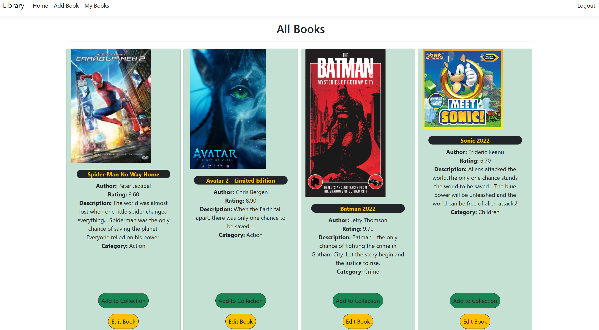
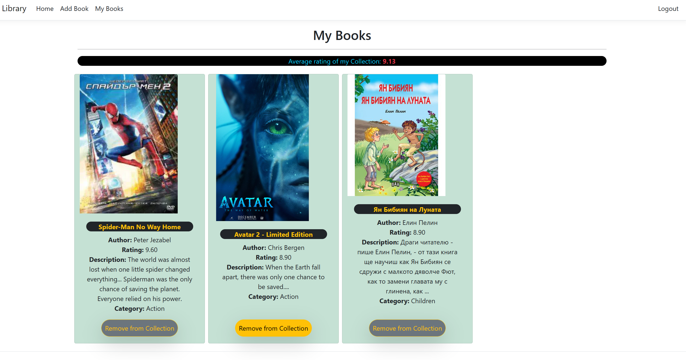

# Library
This is a simple ASP.NET Core MVC application
Get All Favourite Books into a Library. Determine Average rating and remove it after reading.
If the book data needs to be changed - you are free to do so.

# Getting started...
- Feel free to register an account, which can be filled with collection of books.
- Some data has already been seeded.
- Feel free to get your favourite books collected.
- Once the book has been read - you can remove it.
- If you got some books, you can have their average rating as information.

# Gallery

# Data Base Diagram

